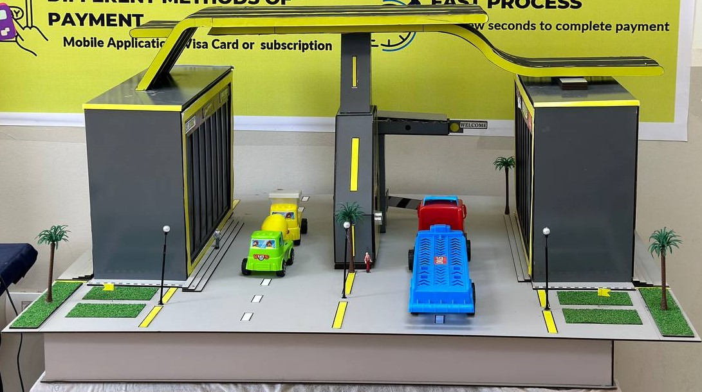

# JANUS Automated Road Gates System (Graduation Project)
### This repository provides concise details about my graduation project, highlighting my contribution in building Computer Vision models for Egyptian license plate number detection and vehicle classification within the Automated Road Gates System.

---

## Project Overview

Janus Automated Road Gates System is a graduation project that aims to resolve the manual road toll collection issues in Egypt, managed by human workers.

The System seamlessly integrates various cutting-edge technologies to create a robust and efficient solution. The system comprises the following components:

- **Mobile App**: The user-friendly mobile application enables users to see gates that are on the road, find information about their toll prices, allows them to pay these tolls before arriving at the gate and a lot of services.

- **Embedded Systems**: The system utilizes embedded devices (such as Ultrasonic Sensor, Servo Motor and RFID Reader) which together form the gate control system.
  
- **Backend**: The backend system, acts as the central hub for data storage, communication, and coordination. It handles API requests from the mobile app and embedded systems, providing seamless integration between different components.

- **Computer Vision Models**: The system lies in the AI models for license plate number detection and vehicle classification. These models process the captured images from the embedded systems and provide accurate results for vehicle identification.
  

## Team Members

- Ahmed Rashed
- Mina Maher
- Nourhan Abosaeed
- Mahmoud Bahaa
- Ahmed Gamal
- Ahmed Roshdi
  

## Project Documentation and Prototype in Action

- **Project Overview Video**: To get an in-depth understanding of the Automated Road Gates System project idea and witness the maquette (prototype) in action, please watch our [project overview video](https://www.youtube.com/watch?v=kQZk_uqAZas).

- **Project Documentation**: For more detailed information about the system's development, including AI models, mobile app, backend, and embedded systems, please refer to our [project documentation](https://drive.google.com/file/d/1yGR7fPZQpwTrd-XG2_s_ieb8_UddPjKI/view).

## Computer Vision Pipeline Overview

## Egyptian License Plate Detection

## License Plate Characters Recognition

## Vehicle Type Classification

## Deployment

### Copyrights

>Copyright (c) 2022-2023 Faculty of Computers and Informatics Tanta University 
